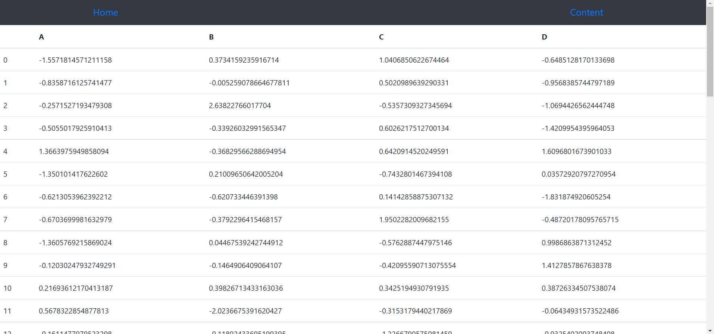
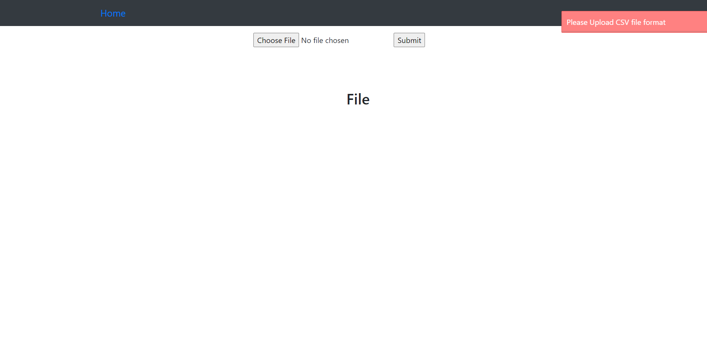
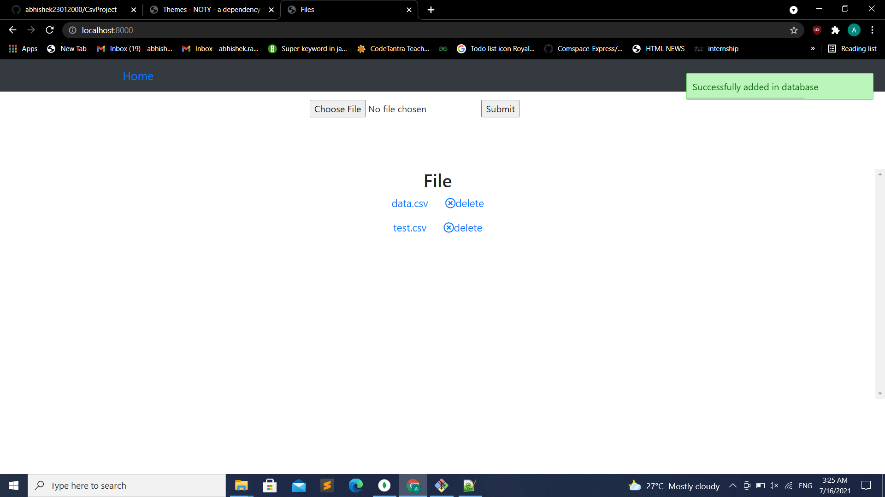

# CsvProject

## How to Use
<ul>
  <li>
      Install NodeJs (nodejs.org)
    </li>
    <li>
    Fork, Clone and open this repository in a terminal/command prompt
    </li>
   
  <li>
  Execute npm install
    </li>
  <li>
Execute npm start
    </li>
   <li>
 Open your preferred web browser and go to "https://localhost:8000" 
      
  </li>
</ul>

## Tools and Packages used

  

 
  

 

  
   
   

 
 

  

1.Node.js
  

  
  

  

  2.MongoDB 
  

  

  3.Express.js
  

   

  4.Noty
  

   

  4.Ejs
  

 

## Screenshots
<h3>Data of csv file</h3>

 

  

  <h3>Home-Page after uploading csv file</h3>
    

 

  

  
   <h3>Flah error </h3>
    

 

  

  
   <h3>File added</h3>
    

 
 

  

  
   

